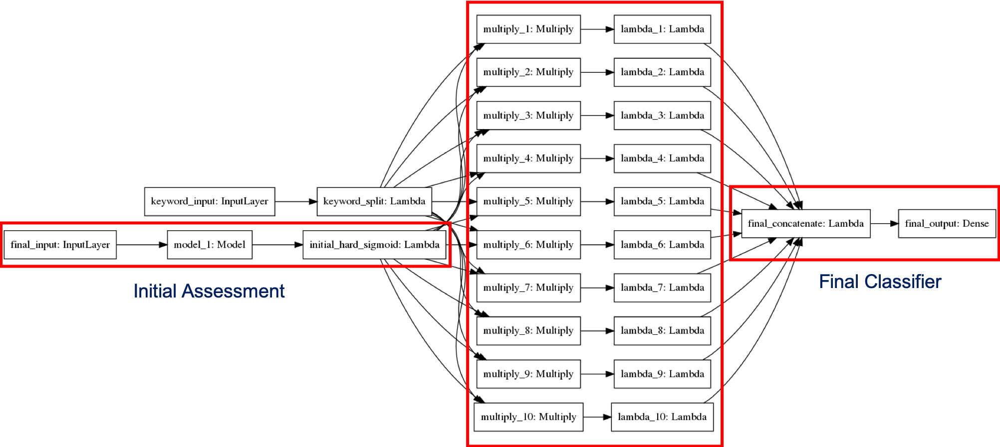

# Interpretable and Cautious Text Classification

## Description
This repo is our experiment on our paper "Interpretable and Cautious Text Classification" under preparation.  
To see the detail report please refer to this [link](https://github.com/IIT-ML/ann-mitchell-text-classification/blob/master/REPORT.md).

## Demo
To quick demo on the notebook please go to the following:
1. IMDB data [notebook](https://github.com/annekehdyt/interpretable-cautious-text/blob/master/Program%20Pipeline.ipynb)

## Data
### Dataset
1. IMDB [[source]](https://ai.stanford.edu/~amaas/data/sentiment/)[[keyword]]()
2. [Arxiv]()
3. [AGNews]()

#2. [Amazon](http://jmcauley.ucsd.edu/data/amazon/)
#3. [E-commerce](https://www.kaggle.com/nicapotato/womens-ecommerce-clothing-reviews)

#Scientific Paper Classification
1. PeerRead [[data](https://github.com/allenai/PeerRead)] [[summary](https://github.com/IIT-ML/ann-mitchell-text-classification/blob/master/data/PeerRead-meta.md)] [[notebook](https://github.com/IIT-ML/ann-mitchell-text-classification/blob/master/scientific_paper_data_debug.ipynb)]

### Keyword (.txt format)
1. IMDB (83 keyword) link [here](https://github.com/annekehdyt/interpretable-cautious-text/blob/master/data/imdb-unigrams.txt)

## Model illustration

## Usage
To see help option:

``python3 model.py -h``

### Train model
   
``python3 model.py --gpu --dataset [DATASET_NAME] --train_mode 3 --epochs 1 --batch_size 1``
  
Example : 
``python3 model.py --gpu --dataset "imdb" --train_mode 3 --epochs 1 --batch_size 1``

### Test model
  
``python3 model-py --gpu --testing --weights [WEIGHT NAME] --dataset [DATASET_NAME]``
  

For explanation demo, please refer to [notebook](https://github.com/annekehdyt/interpretable-cautious-text/blob/master/Program%20Pipeline.ipynb)
  The ``show_explanation`` function won't work if viewed in github. Please clone the repo and run the notebook
