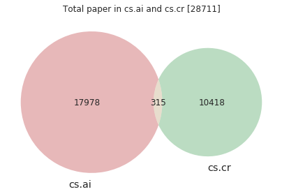

# Arxiv data

The full link to the Arxiv parquet data can be found in :  
`./dataset/arxiv_cs_09_19_data.parquet`  
For partial data in cs.ai VS cs.cr:  
`./dataset/arxiv_ai_crypto_data.parquet`
 

Note: Please ask Ann for parquet datafile  

## AI vs CRYPTO
We have overlap between AI and Crypto categories. Thus, in this experiment, I decided to exclude the overlap papers to make sure that both categories have distinct keyword. 

